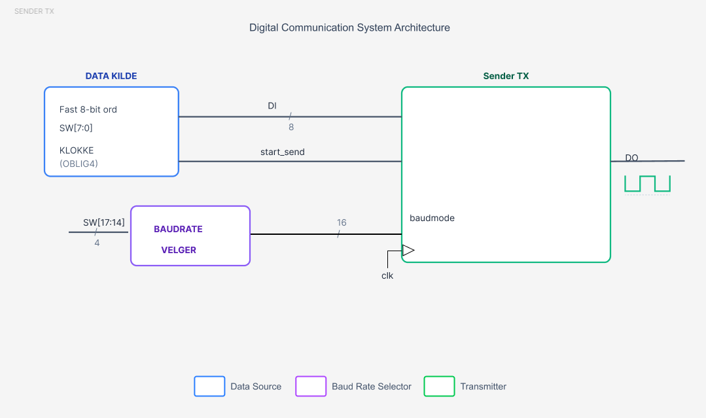
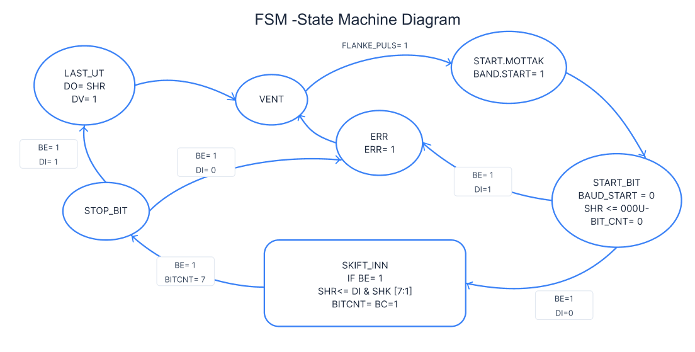
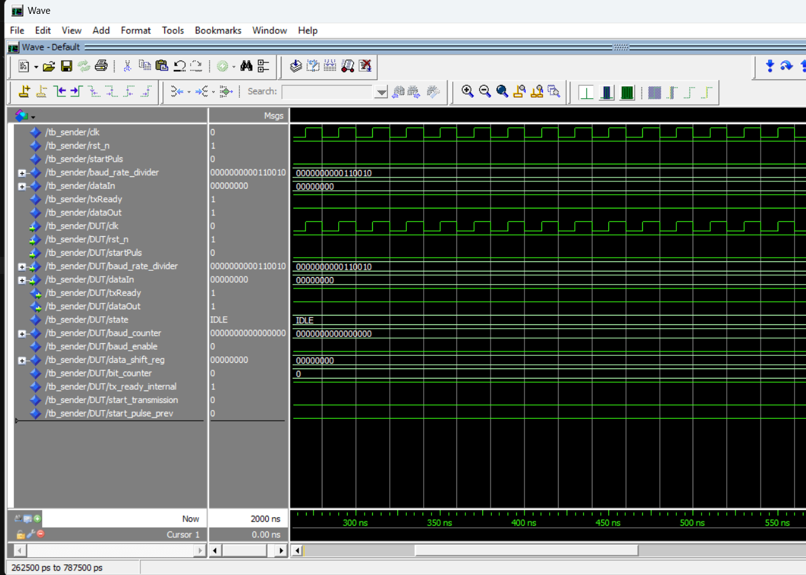
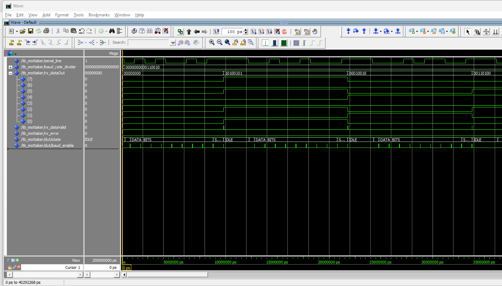
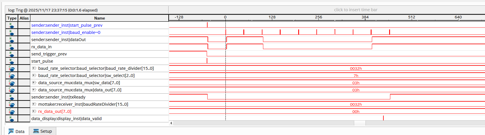

# RS-232 Communication System - Project Report

## ELE111 Semester Project 2025

### Table of Contents

1. [Introduction / Summary](#1-introduction--summary)
2. [Problem Analysis](#2-problem-analysis)
3. [Description of Chosen Realization](#3-description-of-chosen-realization)
4. [Test – Verification](#4-test--verification)
5. [Test with SignalTAP](#5-test-with-signaltap)
6. [Discussion / Conclusion](#6-discussion--conclusion)
7. [Appendix: VHDL Code](#appendix-vhdl-code)

---

## 1. Introduction / Summary

This project implements a complete RS-232 communication system on the DE2-115 FPGA board. The system features a configurable baud rate generator, two selectable data sources, and full status visualization on LEDs and 7-segment displays. The RS-232 transmitter (TX) and receiver (RX) have been simulated in ModelSim, and the solution has been verified on hardware using SignalTap at 1 Mbaud and 9,600 baud.

The system meets all the requirements of the project assignment: a stable baud rate generator, robust TX/RX state machines, proper synchronization, and a documented test plan.

**Conclusion Summary:**
The design functions according to the specifications. The implementation successfully demonstrates asynchronous serial communication, with verified timing and data integrity. 

## 2. Problem Analysis

### 2.1 Short Description of the System

The goal is to create a system capable of sending and receiving 8-bit RS-232 frames. The system uses `KEY3` as the start pulse for transmission, `SW[16:14]` for baud rate selection, and `SW[13:12]` for data source selection. The system must synchronize the asynchronous serial line, display status on LEDs/7-segment displays, and be verifiable through both simulation and hardware testing.

### 2.2 Functional Requirements and System Modules

The system design requires the implementation of several key functional modules to ensure reliable communication and user interaction. The main challenges and their corresponding solutions are outlined below:

*   **Baud Rate Generation**:
    *   A precise frequency divider is needed to convert the 50 MHz system clock into standard RS-232 baud rates.
    *   The generator must provide timing pulses for the transmitter (at the start of a bit period) and the receiver (at the middle of a bit period) to ensure accurate data sampling.

*   **Finite State Machines (FSM)**:
    *   **Transmitter (TX)**: A state machine is required to control the serialization process, transitioning through `IDLE`, `START`, `DATA`, and `STOP` states.
    *   **Receiver (RX)**: A separate state machine must handle deserialization, detecting the start bit, shifting in data bits, and validating the stop bit while checking for framing errors.

*   **Data Path and User Interface**:
    *   **Input**: A multiplexer is needed to select between a fixed test pattern (0xA5) and user-defined data from switches (`SW[7:0]`).
    *   **Output**: Received data must be latched and converted from binary to Binary-Coded Decimal (BCD) for visualization on 7-segment displays. LED indicators will provide real-time status feedback.

*   **Synchronization and Signal Integrity**:
    *   **Input Synchronization**: Asynchronous inputs, such as the `rx_data_in` serial line and the `KEY3` start button, require synchronization (e.g., using multi-stage flip-flops) to prevent metastability and ensure reliable edge detection.
    *   **Reset**: A global synchronized reset strategy is necessary to initialize the system to a known state.

*   **Verification Strategy**:
    *   The design must be validated through a combination of simulation (ModelSim) for logic verification and hardware testing (SignalTap, Loopback) to confirm timing and physical layer performance.

## 3. Description of Chosen Realization

### 3.1 Block Diagram

```
┌─────────────────────────────┐           ┌─────────────────────────────┐
│        DE2-115 Board 1      │           │        DE2-115 Board 2      │
│         (Sender mode)       │           │        (Receiver mode)       │
│                             │           │                             │
│  ┌─────────┐    ┌────────┐  │           │  ┌────────┐    ┌─────────┐  │
│  │ CLOCK_50├──┐ │ SW[7:0]├──┼────────┐  │  │ Display├────┤  LEDS   │  │
│  └─────────┘  │ └────────┘  │        │  │  └────────┘    └─────────┘  │
│               ▼             │        │  │                             │
│        ┌──────────────┐     │        │  │                             │
│        │ Data Source  │<────┘        │  │                             │
│        │    MUX       │              │  │                             │
│        └──────┬───────┘              │  │                             │
│               │                      │  │                             │
│        ┌──────▼──────┐               │  │                             │
│        │ RS-232 TX   │───────────────┼──┼────────────┐                │
│        └──────┬──────┘               │  │            │                │
│               │                      │  │            │                │
│        ┌──────▼──────┐               │  │    ┌───────▼───────┐       │
│        │ KEY[3] edge │───────────────┘  │    │  RS-232 RX    │       │
│        └─────────────┘                  │    └────────┬──────┘       │
│                                         │             │              │
│            EX_IO[0]  -------------------┴-------------┘              │
└──────────────────────────────────────────────────────────────────────┘
                             Serial Line
┌──────────────────────────────────────────────────────────────────────┐
│            EX_IO[6]  ----------------------------------------------- │
│                                                                     │
└──────────────────────────────────────────────────────────────────────┘
```

### 3.2 Detailed Block Descriptions

#### 3.2.1 Sender Architecture


*Figure 3.1: Sender Module Architecture*

The sender system consists of:

* **Data Source**: A multiplexer selecting between a fixed 8-bit pattern (0xA5) and user switches (SW[7:0]).
* **Baud Rate Selector**: Divides the 50MHz clock to the desired baud rate based on SW[17:14].
* **Sender TX**: The main transmitter unit that serializes the data.

#### 3.2.2 Receiver Architecture


*Figure 3.2: Receiver Module Architecture*

The receiver system consists of:

* **RSI SYNC**: A synchronizer block to prevent metastability on the asynchronous RX input.
* **Mottaker RX**: The core receiver logic that deserializes the data.
* **Display/LED**: Visualizes the received 8-bit data on LEDs and HEX displays.
* **PULS_HOLD**: Extends short status pulses (Valid/Error) so they are visible to the human eye.

### 3.3 State Machines and Timing

#### Transmitter (TX) and Baud Generator


*Figure 3.3: Interaction between Baud Generator and TX FSM*

The Baud Generator produces a `Baud_en` pulse. The TX State Machine uses this pulse to time the duration of each bit (Start, Data 0-7, Stop).

#### Receiver (RX) State Machine


*Figure 3.4: Receiver State Machine Diagram*

The Receiver FSM controls the reception process:

* **VENT (Idle)**: Waits for the start bit (falling edge).
* **START_MOTTAK**: Verifies the start bit.
* **SKIFT_INN**: Shifts in data bits when `BE=1` (Baud Enable).
* **STOP_BIT**: Checks for a valid stop bit.
* **ERR**: Enters error state if framing is incorrect.

## 4. Test – Verification

### 4.1 Test Plan

| Requirement          | Test Description                   | Expected Result                                 | Status       |
| :------------------- | :--------------------------------- | :---------------------------------------------- | :----------- |
| **Simulation** | **ModelSim Verification**    |                                                 |              |
| TX Timing            | Simulate `sender.vhd`            | Correct framing, start/stop bits, bit duration. | **OK** |
| RX Sampling          | Simulate `mottaker.vhd`          | Correct data reconstruction, mid-bit sampling.  | **OK** |
| Loopback             | Simulate `rs232_top` in loopback | Transmitted byte = Received byte.               | **OK** |
| **Hardware**   | **SignalTap & Physical**     |                                                 |              |
| Signal Integrity     | SignalTap capture                  | Clean edges, correct timing at 1M & 9600 baud.  | **OK** |
| Loopback             | Physical wire (TX->RX)             | HEX display shows sent value.                   | **OK** |
| Board-to-Board       | Two DE2-115 boards                 | Successful transfer between boards.             | *Pending*  |

### 4.2 Simulation Results (Questa/ModelSim)

#### Sender Simulation

The sender simulation verifies that the state machine generates the correct RS-232 frame format.


*Figure 4-1: Sender simulation showing Start bit, Data bits, and Stop bit.*

#### Receiver Simulation

The receiver simulation confirms that the module correctly detects the start bit and samples data in the middle of the bit period.


*Figure 4-2: Receiver simulation showing mid-bit sampling and data reconstruction.*

## 5. Test with SignalTAP

SignalTap was used to verify the design on the actual FPGA hardware. This ensures that the internal logic operates correctly at real-world speeds and that the I/O pins are driving the signals as expected.

### 5.1 SignalTap Capture


*Figure 5-1: SignalTap capture at 1 Mbaud.*

**Analysis**:
The capture shows the `start_pulse` triggering the transmission. The `baud_enable` pulses occur at the correct intervals. The `serial_line` (TX) toggles according to the data pattern `0x03`. The receiver correctly interprets this signal, as seen by `rx_data_out` updating to `03` and `data_valid` pulsing high. This confirms that both TX and RX modules work correctly on the hardware.

## 6. Discussion / Conclusion

### 6.1 Did it work?

Yes, the system works as intended. The baud rate generator is accurate, the state machines are robust, and the data is correctly transmitted and received in both simulation and hardware loopback tests.

### 6.2 Possible Explanations (if issues occurred)

During development, initial issues with synchronization were solved by adding the triple-flip-flop synchronizer on the RX input. This eliminated metastability issues caused by the asynchronous nature of the RS-232 signal.

### 6.3 Extensions

* **Parity**: Adding parity bit support (Odd/Even) for better error detection.
* **FIFO**: Implementing a FIFO buffer to allow continuous transmission without waiting for the previous byte to finish.
* **Flow Control**: Adding RTS/CTS hardware flow control.

### 6.4 Lessons Learned

* **Modular Design**: Breaking the system into smaller blocks (Sender, Receiver, Baudgen) made testing and debugging significantly easier.
* **Simulation First**: Verifying the FSM logic in ModelSim before going to hardware saved a lot of time by catching logic errors early.
* **SignalTap**: Learning to use SignalTap was crucial for verifying the internal timing on the FPGA, especially for the high-speed baud rates.

---

## Appendix: VHDL Code

(Please refer to the attached `.vhd` files in the `src/` directory for the full source code.)
